# 인증 플로우

화면과 기능을 가로지르는 인증 journey. 규칙은 [features/AUTH.md](../features/AUTH.md), 인프라 설정은 [AUTH-SETUP.md](../AUTH-SETUP.md) 참조.

## 내부 사용자 로그인 (GitHub OAuth)

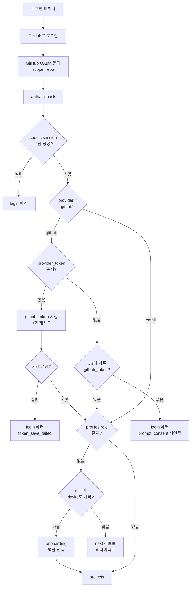

- `signInWithOAuth` → GitHub 동의 화면 (scope: `repo`)
- 콜백에서 Supabase 세션 생성 + `provider_token` 수집
- email provider는 GitHub 토큰 체크를 스킵 (게스트 매직링크 경로)
- `/invite/`로 시작하는 next가 있으면 온보딩 스킵

## provider_token 누락 대응

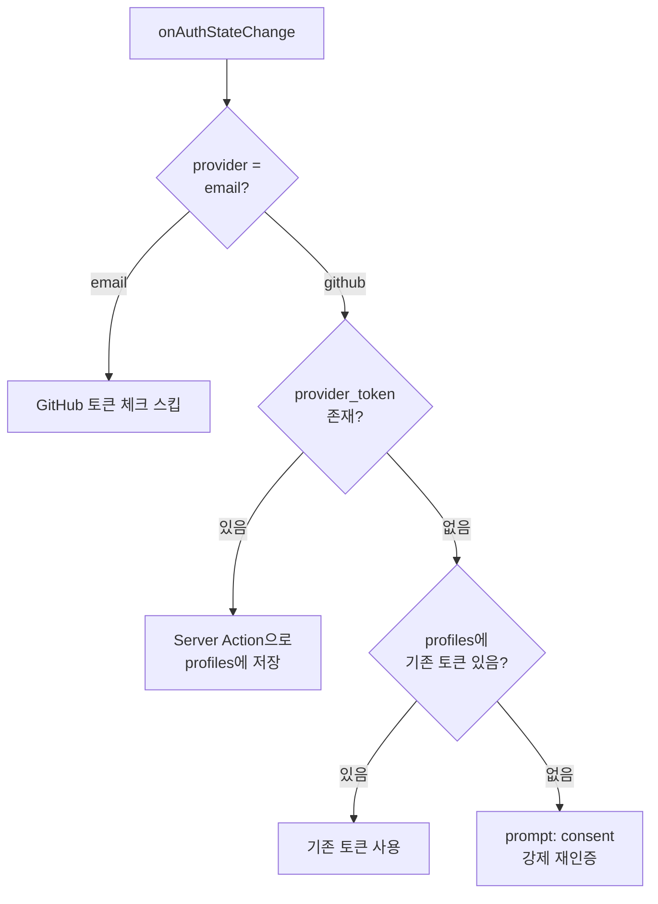

Supabase Auth는 `provider_token`을 최초 로그인 시에만 반환한다. 세션 refresh 시에는 반환하지 않으므로, 기존 토큰이 없으면 `prompt: 'consent'`로 강제 재인증한다.

## provider_token 저장 실패 대응

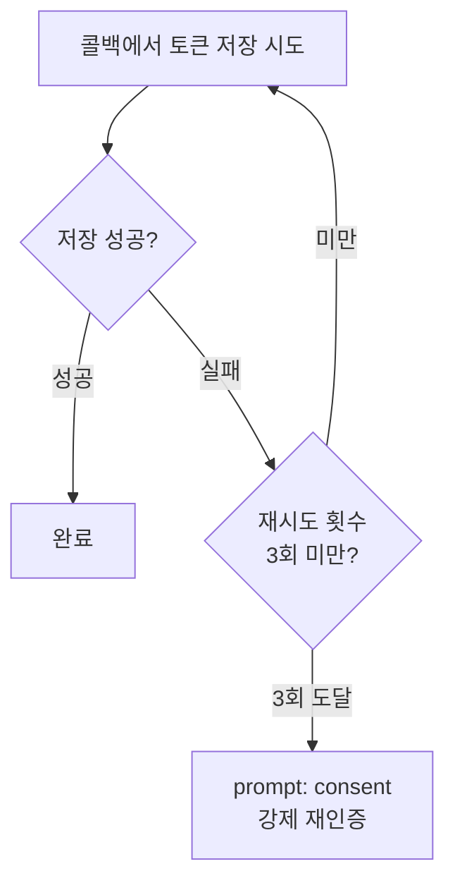

Supabase는 `provider_token`을 재발급하지 않으므로 즉시 3회 재시도하고, 실패 시 강제 재인증으로 복구한다.

## 게스트 초대 — 오너 측

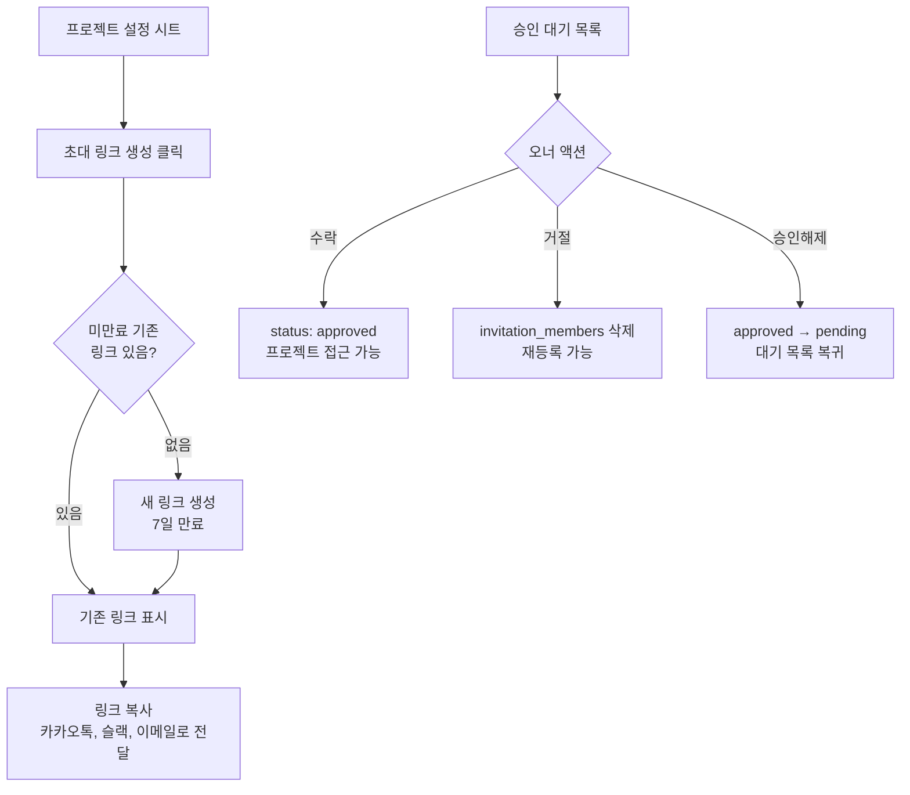

## 게스트 초대 — 게스트 측

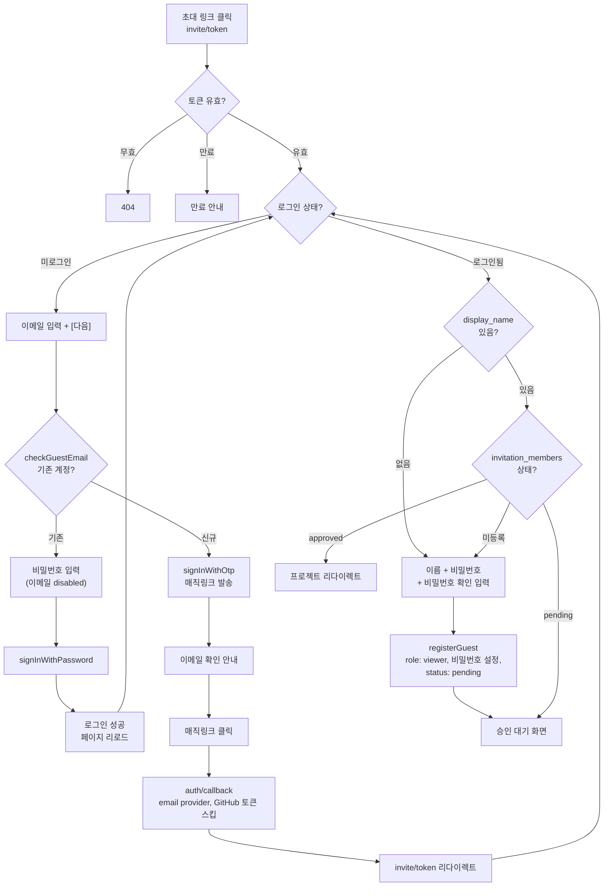

## 게스트 재방문 — 이메일+비밀번호 로그인

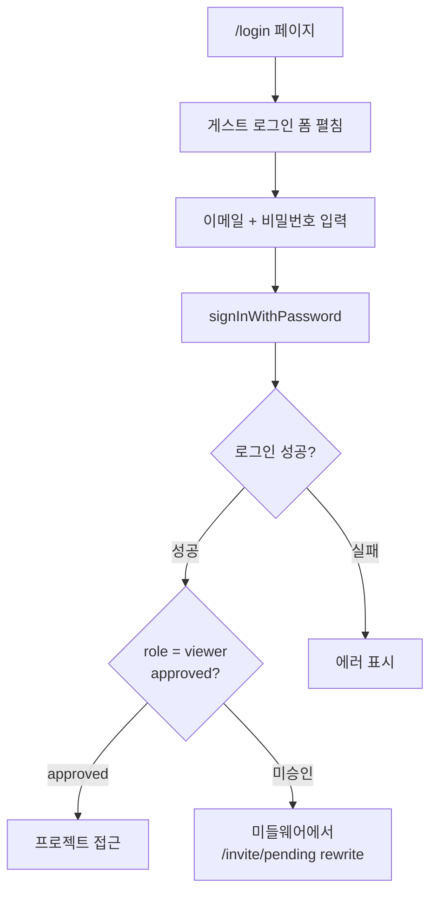

게스트 로그인 폼은 기본 접힘 상태. 내부 사용자(GitHub 로그인)가 혼동하지 않도록 토글로 분리.

## 비밀번호 재설정

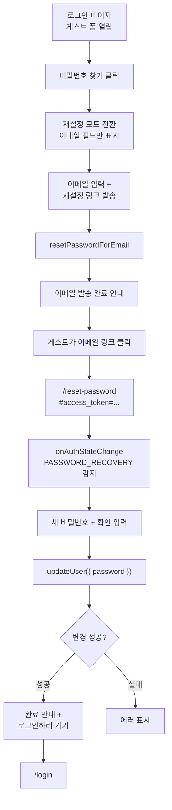

recovery 세션 제약으로 변경 후 자동 로그인하지 않고 `/login`으로 안내한다.

## 토큰 무효화 대응 (OAuth 토큰)

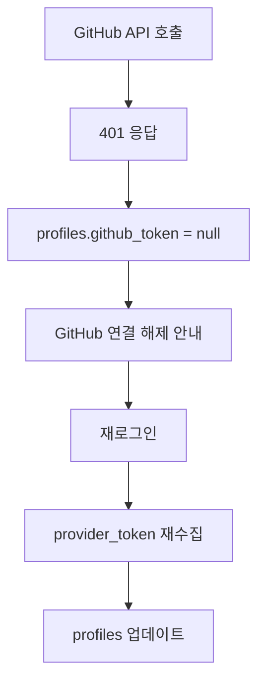

GitHub OAuth 토큰은 만료되지 않지만 사용자가 연동 해제·비밀번호 변경·직접 revoke 시 무효화된다.

## Installation 토큰 갱신 (GitHub App)

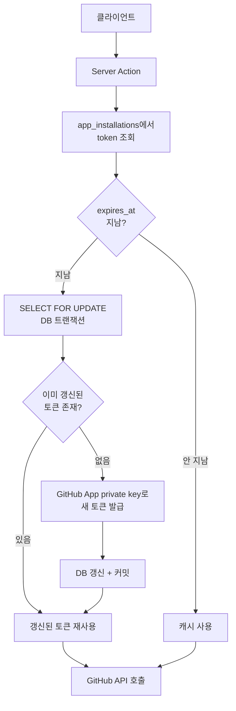

Installation 토큰은 1시간 만료. 동시 요청 시 race condition 방지를 위해 트랜잭션으로 갱신한다.

## GitHub App 설치

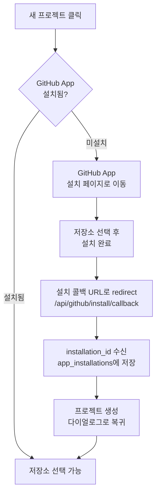

## 미들웨어 접근 제어 (viewer)

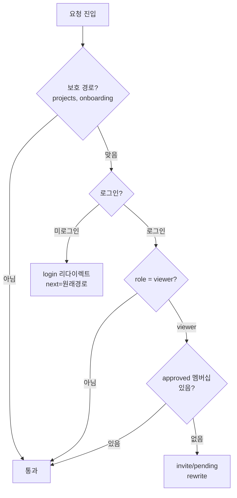

viewer(pending) 상태의 사용자가 `/projects` 또는 `/onboarding`에 접근하면 `/invite/pending`으로 rewrite된다. approved된 viewer는 정상 통과.

## 게스트 코멘트 대리 생성

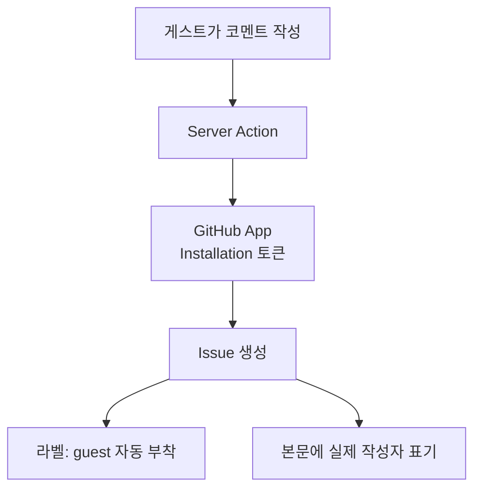

게스트(viewer)는 GitHub 토큰이 없으므로 GitHub App(봇)이 Installation 토큰으로 Issue를 대리 생성한다. 이슈 본문에 실제 작성자 이메일을 메타데이터로 포함하여 플랫폼 UI에서는 실제 작성자로 표시.
